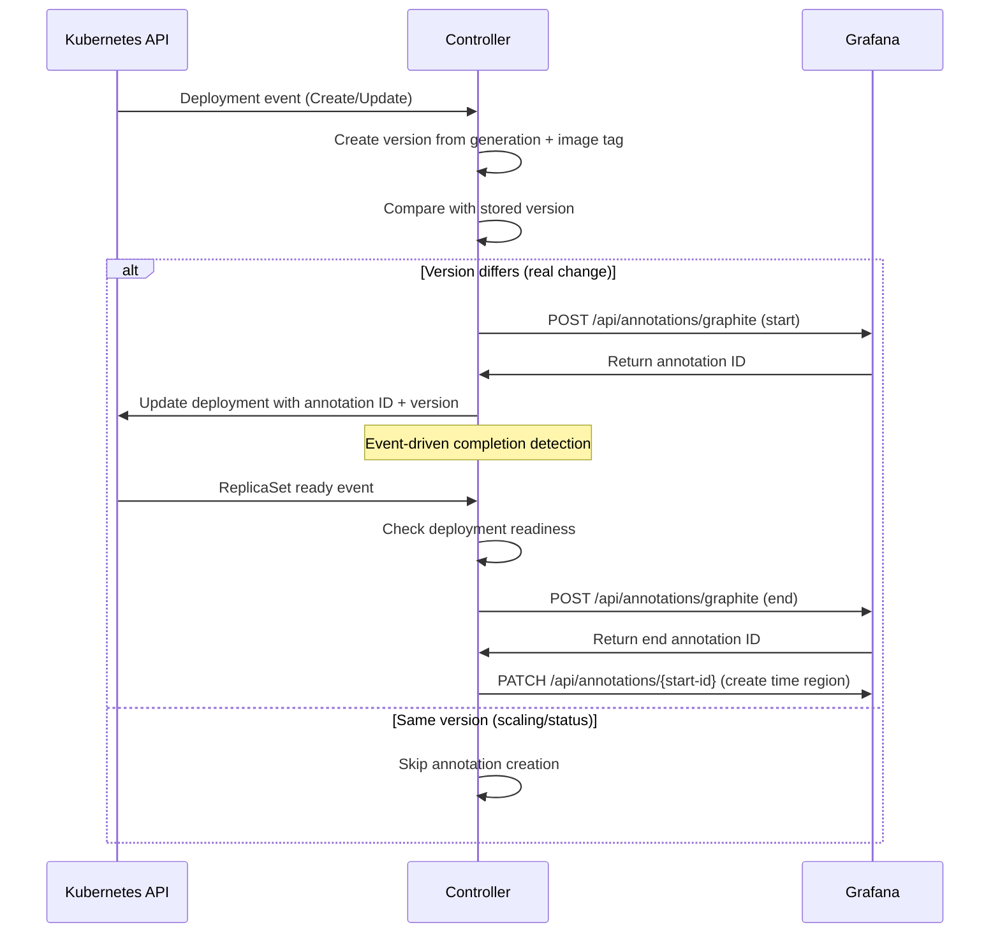

# Deployment Annotator for Grafana

## Badges

[](https://github.com/perun-engineering/deployment-annotator-for-grafana/actions/workflows/ci.yml) [](https://github.com/perun-engineering/deployment-annotator-for-grafana/actions/workflows/security.yml) [](https://github.com/perun-engineering/deployment-annotator-for-grafana/actions/workflows/release.yml) [](https://goreportcard.com/report/github.com/perun-engineering/deployment-annotator-for-grafana) [](https://opensource.org/licenses/MIT) [](https://github.com/perun-engineering/deployment-annotator-for-grafana/pkgs/container/deployment-annotator-for-grafana)

A production-ready Kubernetes Controller that automatically creates per-component [Grafana annotations](https://grafana.com/docs/grafana/latest/developers/http_api/annotations/) for deployment events, providing granular timing visibility that traditional CI/CD pipeline annotations cannot offer.

## Why This Tool?

### Traditional CI/CD Annotation Approach

In traditional CI/CD pipelines, deployment annotations are typically created manually during the deployment step:

```yaml
# Traditional approach - single annotation for entire pipeline
- name: Create deployment annotation
  run: |
    curl -X POST $GRAFANA_URL/api/annotations \
      -d '{"what":"deploy-start:my-app","when":'$(date +%s)'}'

- name: Deploy with Helm
  run: helm upgrade my-app ./chart --wait

- name: Create completion annotation
  run: |
    curl -X POST $GRAFANA_URL/api/annotations \
      -d '{"what":"deploy-end:my-app","when":'$(date +%s)'}'
```

### Problems with Traditional Approach

- **Coarse-Grained Timing**: Single timeline for entire Helm chart deployment
- **No Component Visibility**: Cannot distinguish between individual component deployment times
- **Hidden Bottlenecks**: Masks which specific components are slow to deploy
- **Independent Lifecycles**: Components have different startup times and may fail independently
- **Scaling vs Deployment Confusion**: Pipeline annotations don't distinguish between scaling and actual updates

### This Controller's Approach

#### **Per-Component Granular Tracking**

```
Database:   ├────────────────────────────────────────┤ (5 min)
Backend:    ├─────────────────────┤                     (2 min)
Frontend:   ├──────────┤                                 (30 sec)
Worker:     ├────────────────┤                           (1 min)
Cache:      ├─────┤                                      (10 sec)
```

Each deployment gets its own annotation timeline showing:
- **Exact start time** when deployment spec changes
- **Individual rollout duration** for each component
- **Precise completion time** when all replicas are ready
- **Component-specific issues** that don't affect others

#### **Better Observability**

**Traditional View:**
```
MyApp Deployment: Started 10:00 → Finished 10:05 (5 minutes)
```

**Controller View:**
```
Database:  Started 10:00 → Finished 10:05 (5 minutes)
Backend:   Started 10:00 → Finished 10:02 (2 minutes)
Frontend:  Started 10:00 → Finished 10:00 (30 seconds)
Worker:    Started 10:00 → Finished 10:01 (1 minute)
Cache:     Started 10:00 → Finished 10:00 (10 seconds)
```

**Insights gained:**
- Database is the bottleneck (5x slower than next component)
- Frontend and cache deploy very quickly
- Backend and worker have reasonable deployment times
- You can optimize database deployment strategy

#### **Real-World Benefits**

1. **Performance Debugging**: Identify which components slow down deployments
2. **Resource Planning**: Understand individual component resource needs
3. **Rollback Decisions**: See which specific component failed during deployment
4. **SLA Tracking**: Monitor component-level deployment SLAs
5. **Team Accountability**: Different teams can track their component's deployment performance


## Overview

This controller watches `apps/v1` **Deployments**, **StatefulSets**, **DaemonSets** and **Namespaces**. It automatically processes these workloads in namespaces labeled with `deployment-annotator=enabled` and provides instant annotation cleanup when labels are removed. When a workload specification actually changes (not just scaling), it:

1. Uses Kubernetes `generation` and image tag to create a version identifier
2. Compares current version with previously stored version to detect actual changes
3. Creates Grafana annotations only for real changes, not scaling/rescheduling events
4. Stores annotation IDs and version in workload annotations for persistence
5. Monitors the workload until it becomes available/ready
6. Updates the Grafana annotation to mark the completion

## Features

- **Per-component granular tracking**: Individual workload timelines instead of single CI/CD pipeline annotation
- **Multi-component Helm chart support**: See exact timing for each deployment within complex charts
- **Smart change detection**: Uses Kubernetes generation + image tag to detect actual changes vs scaling/rescheduling events
- **Event-driven completion**: Watches ReplicaSet events for Deployments and status updates for StatefulSets/DaemonSets (no polling)
- **KEDA/HPA compatible**: Ignores replica count changes, only tracks real application updates
- **Dynamic namespace filtering**: Watches namespace label changes and immediately processes existing workloads
- **Automatic annotation cleanup**: Removes all annotations when namespace label is removed
- **Stateless operation**: Survives pod restarts by storing annotation IDs and versions in workload annotations
- **Production-ready**: Includes proper RBAC, security contexts, and health checks
- **Helm deployment**: Complete Helm chart with configurable values

## Prerequisites

- Kubernetes cluster (1.19+)
- Grafana instance with API access
- Grafana API key with annotation permissions
- Helm 3.x

## Quick Start

### 1. Install with Helm

```bash
# Install the controller
helm install deployment-annotator-controller oci://ghcr.io/perun-engineering/deployment-annotator-for-grafana/helm/deployment-annotator-controller \
  --set grafana.url=https://your-grafana-instance.com \
  --set-string grafana.apiKey=your-grafana-api-key
```

### 2. Enable Namespace Tracking

Label your namespace to enable deployment tracking:

```bash
# Label your namespace for tracking
kubectl label namespace your-namespace deployment-annotator=enabled

# Or create a new test namespace with the label
kubectl create namespace test-grafana-tracking
kubectl label namespace test-grafana-tracking deployment-annotator=enabled
```

> **Note:** The controller automatically detects namespace label changes. When you add the `deployment-annotator=enabled` label, all existing deployments in that namespace will immediately get start annotations for their current versions. When you remove the label, all deployment annotations will be cleaned up automatically.

### 3. Monitor Deployments

```bash
# Check controller logs to see deployment tracking
kubectl logs -l app.kubernetes.io/name=deployment-annotator-controller -f

# Deploy or update any application in the labeled namespace
kubectl apply -f your-deployment.yaml -n test-grafana-tracking

# Monitor the deployment
kubectl rollout status deployment/your-deployment -n test-grafana-tracking
```

## Configuration

### Environment Variables

| Variable | Description | Required | Default |
|----------|-------------|----------|---------|
| `GRAFANA_URL` | Grafana instance URL | Yes | - |
| `GRAFANA_API_KEY` | Grafana API key with annotation permissions | Yes | - |
| `LOG_LEVEL` | Logging level (info, debug, error) | No | `info` |
| `LOG_DEVELOPMENT` | Enable development mode logging | No | `false` |

### Helm Values

Key configuration options in `values.yaml`:

```yaml
# Grafana configuration
grafana:
  url: "https://your-grafana-instance.com"
  apiKey: "your-api-key"

# Controller configuration
controller:
  maxConcurrentReconciles: 5
  log:
    level: "info"           # info, debug, error
    development: false      # Enable debug logs and stack traces

# Controller image
image:
  repository: ghcr.io/perun-engineering/deployment-annotator-for-grafana
  tag: latest

# Single replica to prevent race conditions
replicaCount: 1

# Resource limits
resources:
  limits:
    cpu: 100m
    memory: 128Mi
  requests:
    cpu: 50m
    memory: 64Mi
```

## Namespace Management

### Enabling Tracking

When you add the `deployment-annotator=enabled` label to a namespace, the controller immediately:

1. **Discovers existing deployments** in that namespace
2. **Creates start annotations** for all current deployment versions
3. **Begins tracking future changes**

```bash
# Enable tracking for existing namespace with deployments
kubectl label namespace production deployment-annotator=enabled

# Controller logs will show:
# "Namespace labeled for tracking, enqueuing deployments" namespace="production" deploymentCount=5
# "Created deployment start annotation" deployment="api-server" namespace="production"
# "Created deployment start annotation" deployment="worker" namespace="production"
```

### Disabling Tracking

When you remove the label, the controller automatically:

1. **Cleans up all annotations** from deployments in that namespace
2. **Stops tracking future changes**
3. **Removes deployment-annotator.io/ annotations** completely

```bash
# Disable tracking and clean up annotations
kubectl label namespace production deployment-annotator-

# Controller logs will show:
# "Namespace label removed, cleaning up annotations" namespace="production" deploymentCount=5
# "Cleaned up deployment annotations" deployment="api-server" namespace="production"
# "Cleaned up deployment annotations" deployment="worker" namespace="production"
```

### Annotation Keys

The controller manages these annotation keys on workloads:

- `deployment-annotator.io/start-annotation-id` - Grafana start annotation ID
- `deployment-annotator.io/end-annotation-id` - Grafana end annotation ID  
- `deployment-annotator.io/tracked-version` - Current tracked version (generation + image tag)

## Grafana Configuration

### Setting Up Annotation Queries

To display deployment annotations in your Grafana dashboards, you need to configure annotation queries. This allows you to overlay deployment events on your metrics for better correlation analysis.

#### 1. Built-in Annotations Query

Navigate to your dashboard and add annotation queries:

**Dashboard Settings** → **Annotations** → **Add Annotation Query**

**Basic Configuration:**
```json
{
  "name": "Deployments",
  "datasource": "--Grafana--",
  "enable": true,
  "hide": false,
  "iconColor": "blue",
  "query": {
    "datasource": {
      "type": "grafana",
      "uid": "-- Grafana --"
    },
    "filter": {
      "tags": ["deploy"]
    },
    "limit": 100
  }
}
```

#### 2. Namespace-Specific Annotations

Filter annotations by specific namespaces:

```json
{
  "name": "Production Deployments",
  "datasource": "--Grafana--",
  "enable": true,
  "hide": false,
  "iconColor": "red",
  "query": {
    "datasource": {
      "type": "grafana",
      "uid": "-- Grafana --"
    },
    "filter": {
      "tags": ["deploy", "production"]
    },
    "limit": 100
  }
}
```

#### 3. Application-Specific Annotations

Track specific applications:

```json
{
  "name": "Cart Service Deployments",
  "datasource": "--Grafana--",
  "enable": true,
  "hide": false,
  "iconColor": "green",
  "query": {
    "datasource": {
      "type": "grafana",
      "uid": "-- Grafana --"
    },
    "filter": {
      "tags": ["deploy", "cart-service"]
    },
    "limit": 50
  }
}
```

## How It Works

### 1. Controller Registration

The controller uses controller-runtime to watch multiple resources:

- **Deployment events**: Creates annotations when deployment specs change; tracks completion via ReplicaSets
- **StatefulSet events**: Creates annotations when StatefulSet specs change; tracks readiness via status
- **DaemonSet events**: Creates annotations when DaemonSet specs change; tracks readiness via status
- **Namespace events**: Processes existing workloads when labels change

### 2. Smart Change Detection

The controller uses Kubernetes native fields to detect actual deployment changes:

1. **Generation Tracking**: Uses deployment `generation` which increments only on spec changes
2. **Image Tag Tracking**: Combines generation with container image tag for version identification
3. **Version Comparison**: Compares current version (gen-X-img-Y) with stored version in annotations
4. **Scaling Ignored**: Replica count changes don't increment generation, so no annotations created

### 3. Deployment Processing

When a deployment specification actually changes:



### 4. Grafana Annotations

**Start Annotation:**
```json
{
  "what": "deploy-start:cart-service",
  "tags": ["deploy", "production", "cart-service", "1.21", "started"],
  "data": "Started deployment nginx:1.21",
  "when": 1640995200
}
```

**End Annotation:**
```json
{
  "what": "deploy-end:cart-service",
  "tags": ["deploy", "production", "cart-service", "1.21", "completed"],
  "data": "Completed deployment nginx:1.21",
  "when": 1640995800
}
```

**Time Region Update (Start Annotation):**
```json
{
  "timeEnd": 1640995800000,
  "isRegion": true,
  "tags": ["deploy", "production", "cart-service", "1.21", "region"]
}
```

**Deletion Annotation:**
```json
{
  "what": "deploy-delete:cart-service",
  "tags": ["deploy", "production", "cart-service", "", "deleted"],
  "data": "Deleted deployment cart-service",
  "when": 1640996000
}
```

## Security Considerations

- **RBAC**: Minimal permissions (get/update deployments only)
- **Network policies**: Consider restricting controller network access
- **API key rotation**: Regularly rotate Grafana API keys
- **TLS**: All communication uses TLS encryption
- **Non-root**: Container runs as non-root user (UID 1001)

## Monitoring

The controller exposes metrics and logs for monitoring:

- **Health endpoints**:
  - `/healthz` for liveness probes (port 8080)
  - `/readyz` for readiness probes (port 8080)
- **Metrics endpoint**: `/metrics` for Prometheus scraping (port 8081)
- **Structured logging**: JSON logs with appropriate log levels
- **Controller-runtime metrics**: Built-in metrics for reconciliation performance

## Troubleshooting

### Common Issues

#### Deployments Not Getting Annotations

1. **Check namespace label:**
   ```bash
   kubectl get namespace your-namespace --show-labels
   # Should show: deployment-annotator=enabled
   ```

2. **Check controller logs:**
   ```bash
   kubectl logs -l app.kubernetes.io/name=deployment-annotator-controller -f
   # Look for: "Namespace labeled for tracking, enqueuing deployments"
   ```

3. **Verify deployment events:**
   ```bash
   # Enable debug logging to see all processing
   helm upgrade deployment-annotator-controller oci://ghcr.io/perun-engineering/deployment-annotator-for-grafana/helm/deployment-annotator-controller \
     --reuse-values \
     --set controller.log.level=debug
   ```

#### Grafana API Errors

1. **Check API key permissions:**
   - Ensure the API key has `Editor` role or annotation permissions
   - Test with curl: `curl -H "Authorization: Bearer YOUR_API_KEY" https://your-grafana.com/api/annotations`

2. **Verify Grafana URL:**
   ```bash
   kubectl get configmap deployment-annotator-controller-config -o yaml
   # Check GRAFANA_URL value
   ```

#### Missing Cleanup After Label Removal

1. **Check for manual annotation removal:**
   ```bash
   kubectl get deployment your-deployment -o yaml | grep deployment-annotator.io
   # Should show no results after label removal
   ```

2. **Controller restart may be needed:**
   ```bash
   kubectl rollout restart deployment deployment-annotator-controller
   ```

#### High Availability Mode Not Supported

The controller currently does not support leader election and must run with a single replica to prevent race conditions:

- **Race condition risk**: Multiple replicas create duplicate Grafana annotations and conflicting deployment updates
- **Current limitation**: Controller lacks leader election mechanism
- **Workaround**: Set `replicaCount: 1` in Helm values (default configuration)
- **Impact**: Brief downtime during controller pod restart, but deployment tracking resumes automatically

```bash
# Ensure single replica configuration
helm upgrade deployment-annotator-controller oci://ghcr.io/perun-engineering/deployment-annotator-for-grafana/helm/deployment-annotator-controller \
  --reuse-values \
  --set replicaCount=1
```

### Logging Configuration

Enable debug logging for detailed troubleshooting:

```bash
# Enable debug mode
helm upgrade deployment-annotator-controller oci://ghcr.io/perun-engineering/deployment-annotator-for-grafana/helm/deployment-annotator-controller \
  --reuse-values \
  --set controller.log.level=debug \
  --set controller.log.development=true

# View debug logs
kubectl logs -l app.kubernetes.io/name=deployment-annotator-controller -f
```

Debug logs will show:
- Namespace processing decisions
- Version comparison logic  
- Grafana API request/response details
- Annotation cleanup operations

## Contributing

We use [Conventional Commits](https://www.conventionalcommits.org/) and [Semantic Versioning](https://semver.org/) for this project.

## Licence

This project is licensed under the MIT Licence - see the LICENCE file for details.
